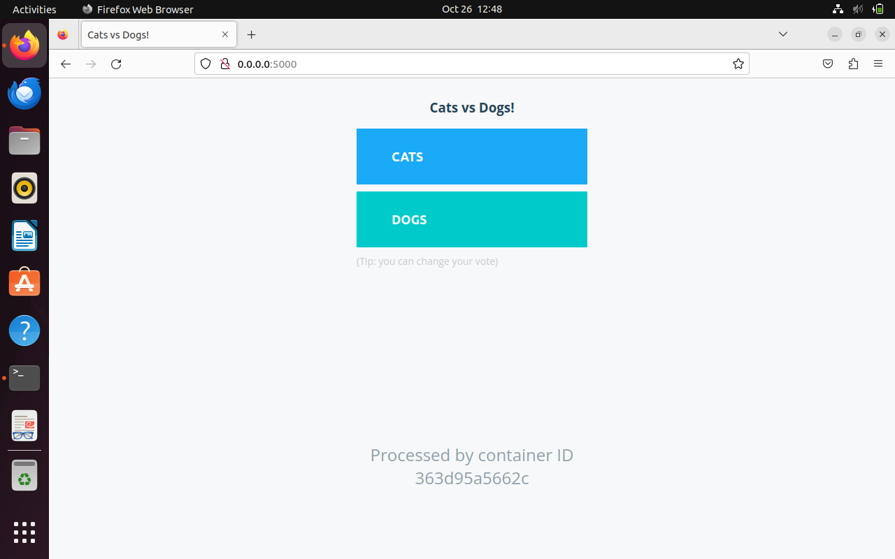
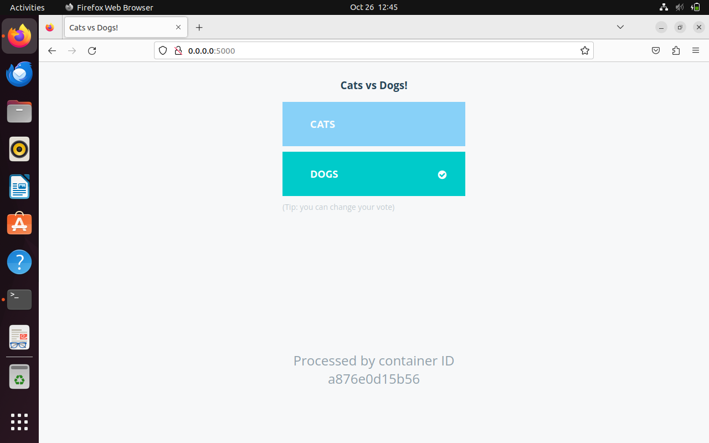
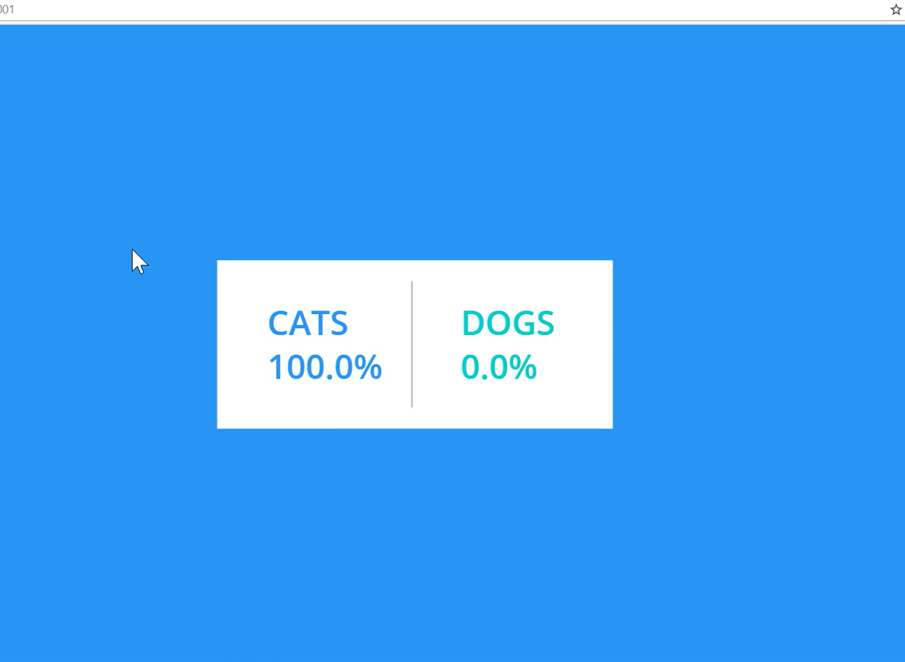

# Example Voting App

A simple distributed application running across multiple Docker containers.

## About the application 
 - A front-end web app in Python which lets you vote between two options
- A Redis which collects new votes
- A .NET worker which consumes votes and stores them in…
- A Postgres database backed by a Docker volume
- A Node.js web app which shows the results of the voting in real time

## Architecture
Through this architecture we can understand the concept of this application.


## Getting started

Before starting, you will need to check the Docker is running on our machine or not.
## Step-1:
A front-end web app in Python which lets you vote between two options
 
- first create a directory for this project and next, change the directory to your project:

    ```bash
        mkdir docker_project
        cd docker_project
    ```
- Download the code 
    ```bash
        git clone https://github.com/dockersamples/example-voting-app.git
    ```
- Change the directory to example-voting-app
    ```bash
        cd example-voting-app
    ```
- Through ls command check the vote directory is present or not. If present then change the directory
    ```bash
        cd vote 
    ```
- In the vote directory have Dockerfile 
- Now build that application through the Dockerfile
    ```bash
        docker build . -t voting-app 
    ```

- Check the docker images
    ```bash
         docker images  
    ```     
    voting-app image is in list.
- Run the voting app on the localhost
    ```bash
         docker run -d -p 5000:80 voting-app 
    ```
- Now, open your web browser and access your voting-app container using the URL http://0.0.0.0:5000 . You should see the voting-app page on the following screen:



- We can't vote at that point.
If we give the vote cats vs dogs it shows an error like Internal Server Error!! 

## Step-2:
A Redis which collects new votes

```bash
    docker run -d --name=redis redis  
```
Above this command it create an immage of redis and check the images through the docker images command.

- Voting-app votes are linked with the redis through this command:
 
    ```bash
    docker run -d -p 5000:80 --link redis:redis voting-app
    ```

- Now, open your web browser and access your voting-app and refresh it...

Now you will see a page where you can vote between two options (Cats vs Dogs) without any internal server issue.



It works fine now..

## Step-3:

A Postgres database backed by a Docker volume.
- Create a container for postgres db and it's version
    ```bash
    docker run -d --name=db postgres:9.4  
    ```
## Step-4:
A .NET worker which consumes votes and stores them in…
- Now create a .NET worker-app container for votes and follow these command 
    ```bash
      cd ..
      cd worker/
    ```
    Now check the Dockerfile and built it.

- For build 
    ```bash
        docker build . -t worker-app
    ```
Now, we can easily link the redis and database server postgres.
```bash
    docker run -d --link redis:redis --link db:db worker-app
```
Hence we connect properly till now.

## Step-5:
A Node.js web app which shows the results of the voting in real time.

This is the final step of our project...

- First follow these commands
    ```bash
      cd ..
      cd result/
    ```
- Create a container for result of voting app
    ```bash
       docker build . -t result-app
    ```
- Now check the docker images
    ```bash
       docker images
    ```
In output we have a multiple docker images.

- Run the Result app on the localhost
    ```bash
       docker run -d -p 5001:80 --link db:db postgres
    ```

- Now, open your web browser and access your voting-app container using the URL http://0.0.0.0:5000 and also access your result-app container using the URL http://0.0.0.0:5001  . You should see the voting-app page and result page in different tab :

- so, it can find database for by db name . because all container are communicate by name of container in same natwork.

### Check url and refresh it.....



## Notes 
The voting application only accepts one vote per client browser. It does not register additional votes if a vote has already been submitted from a client.

This isn't an example of a properly architected perfectly designed distributed app... it's just a simple example of the various types of pieces and languages you might see (queues, persistent data, etc), and how to deal with them in Docker at a basic level.