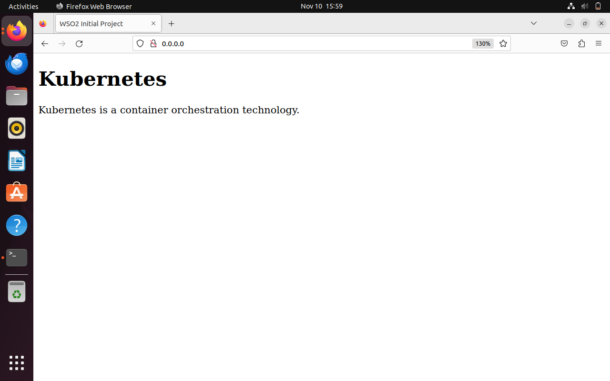

# Containerize Simple Web Page Using Docker

containerize a simple html page and deploy it on a Kubernetes Cluster on localhost.

## Getting started

Before starting, you will need to check the Docker is running on our machine or not.

     sudo systemctl status docker

## Step-1:

- first create a directory for this project and next, change the directory to your project:

  ```bash
      mkdir containerize_app_using_k8s
      cd containerize_app_using_k8s
  ```

- copy the code

  ```bash
       Copy the all file content in your file.

  ```

- build docker image
  ```bash
      docker build -t index-web .
  ```
- To check whether you have created the image, use below command and inspect.
  ```bash
      docker images
  ```
- To run the html container server
  ```bash
      docker run -d -p 80:80 index-web:latest
  ```
- Now, you should be able to see the web page by searching for “localhost:80” in the web browser.  
  

- To Inspect the containers running in the system

```bash
    docker ps
```

# Deploying The Containerized Application In Kubernetes Cluster On localhost.

we have written all the required yaml files. Let’s deploy this in the K8 cluster.

- Create the deployment using the below command.
  ```bash
      kubectl create -f index-web-deployment.yaml
  ```
- Create service using the below command
  ```bash
      kubectl create -f index-web-service.yaml
  ```
- Create Issuer and the Certificate using the below command.

  ```bash
      kubectl create -f index-web-issuer.yaml

      kubectl create -f index-web-certificate.yaml
  ```

- Create the ingress using the below command
  ```bash
      kubectl create -f index-web-ingress.yaml

  ```
- List all resources

  ```bash
      kubectl get all
  ```

- Now, you should be able to access the web page by

localhost:80<br> or <br>
0.0.0.0:80

